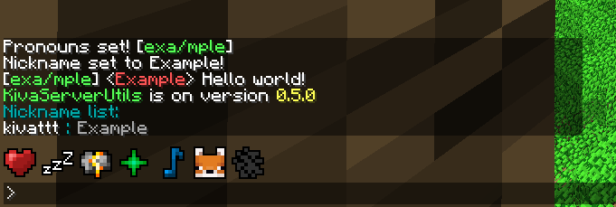

# KivaServerUtils

## Features
Improved player chat, with colors, nicknames and pronouns aswell as red usernames for OP players\
Adds spawn and home commands\
Adds a stricter mob cap which allows mobs to be enabled for servers without lag\
Improved logging for chests and crates, see items being taken/added\
Fixes 100% CPU usage on 1 core\
Explosions (TNT, Creepers, Dynamite etc.) don't break chests/crates.\
Improved logging for players throwing dynamite

## Commands
`/home`\
Teleport to home (If home exists)

`/homewhere`\
Show home location without teleporting to it

`/sethome`\
Sets your home location

`/spawn`\
Teleport to spawn (If spawn location specified)

`/spawnwhere`\
Show spawn location without teleporting to it

`/spawnset` (OP-only command)\
Set the location `/spawn` sends the player

`/spawnreset` (OP-only command)\
Resets spawn location to null

`/nick <nickname>`\
Give yourself a nickname in chat

`/nicklist`\
See everyone's nicknames

`/nickset <player> <nickname>` (OP-only command)\
Force set a players nickname

`/nickreset <optional player>`\
Resets / removes your nickname\
When player supplied, an OP can force reset a players nickname

`/pronouns <pronouns>`\
Give yourself pronouns in chat

`/pronounslist`\
See everyone's pronouns

`/pronounsset <player> <pronouns>` (OP-only command)\
Force set a players pronouns

`/pronounsreset <optional player>`\
Resets / removes your pronouns\
When player supplied, an OP can force reset a players pronouns

`/teleport <x> <y> <z>` (OP-only command)\
Teleport to coordinate

`/mobcapdisabled <true or false>` (OP-only command)\
Enable or disable the mobcap (setting mobcapdisabled to true will introduce lag!)

`/explosionsbreakchests <true or false>` (OP-only command)\
Set if explosions break chests and crates

`/homecommandsdisabled <true or false>` (OP-only command)\
Enable/disable the `/home` and `/sethome` commands

`/kivashowconfig`\
Shows config for KivaServerUtils

`/kivaversion`\
Displays mod version

# Info for mod developers
`Container.updateInventory` is overwritten by this mod,\
keep this in mind if you are writing mixins for this method

# Other
`/sethome` doesn't follow the naming convention `...set` because it's such a common command name in Minecraft servers

All data KivaServerUtils stores is in the `mods/KivaServerUtils` folder